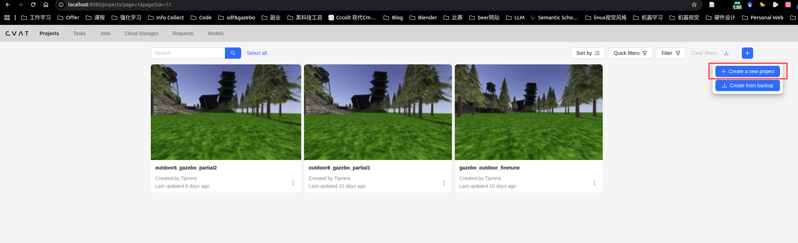
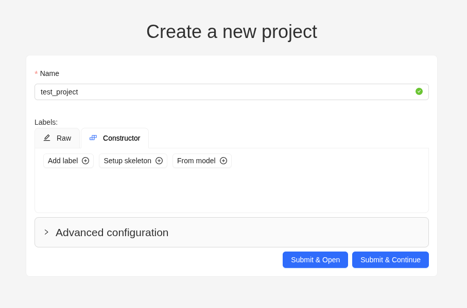
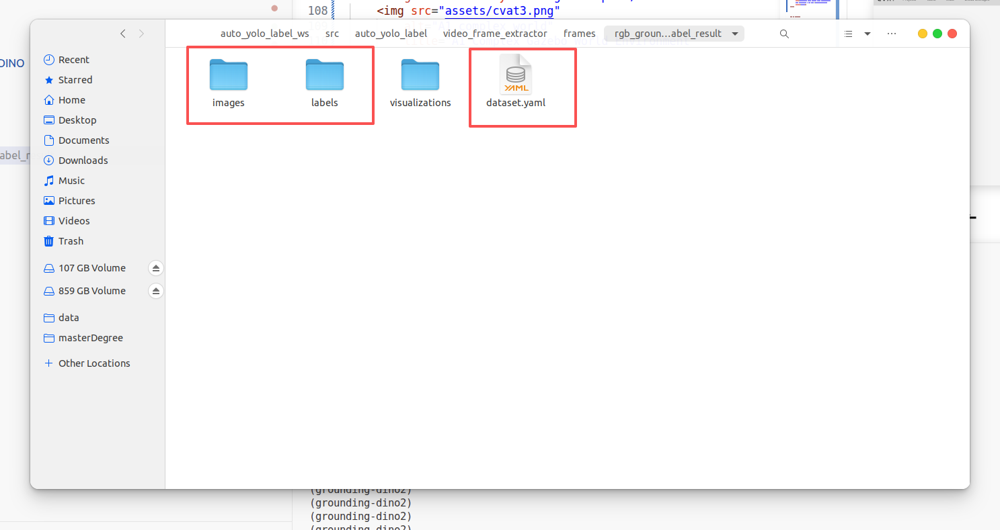
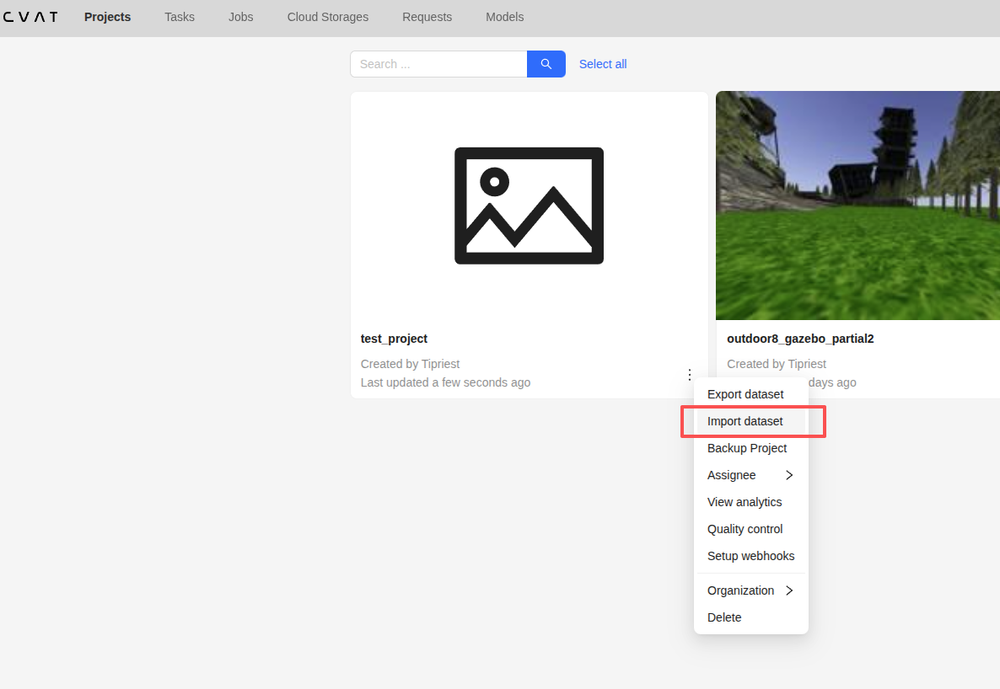
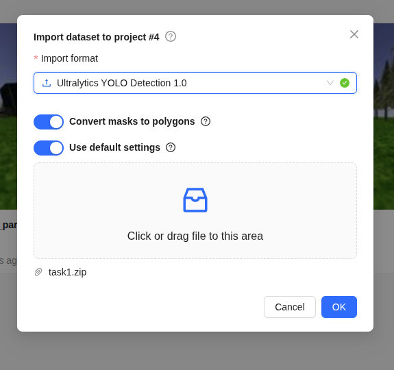
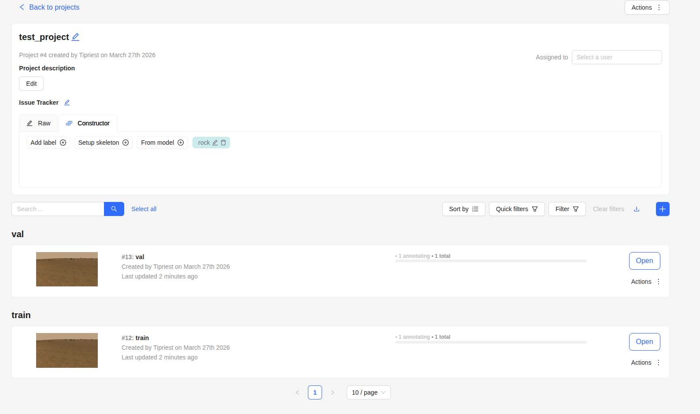
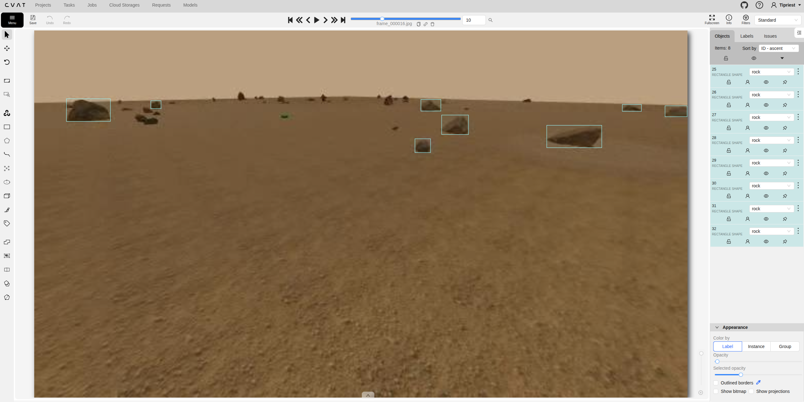

## YOLO 自动标注流程
### 0. 环境配置
需要ROS1环境，中间的某几步需要用conda配置一个新环境
```shell
mkdir -p auto_yolo_label_ws/src && cd ./auto_yolo_label_ws
git clone git@github.com:Tipriest/auto_yolo_label.git ./src/auto_yolo_label
catkin build
```

### 1. ros消息转视频
修改配置文件`rostopic_to_video/config/rostopic_to_video.yaml`
- 这里现在有`RGB`, `Depth`相机深度视频的录制功能，深度的暂且不去管它
- 你只需要将`RGB`相机的话题消息给写到配置参数`rgb_topic`中就可以
- `output_dir`参数可以控制输出文件夹的位置，默认保存位置是`rostopic_to_video`下面叫做`videos`的文件夹内
- 默认名称将会保存名字为`rgb.mp4`和`depth.mp4`的两个视频

```shell
source devel/setup.bash
roslaunch rostopic_to_video rostopic_to_video.launch
```

### 2. 视频帧提取
修改配置文件`rostopic_to_video/config/rostopic_to_video.yaml`
- 需要修改输入的需要提取帧的视频的位置`input_video`
- 可以修改保存输出的视频帧的位置`frames`
- 可以修改其他关于帧选择的策略等
- 可以选择其他关于保存的帧的格式等

```shell
source devel/setup.bash
roslaunch rostopic_to_video rostopic_to_video.launch
```

### 3. grounding-dino自动标注
这个需要配置一下grounding-dino的环境
```shell
git submodule update --init --recursive
conda create -n grounding-dino python==3.9
conda activate grounding-dino
cd ./third_party/GroundingDINO
```
需要注意的是，安装`grounding-dino`需要`pytorch`，安装`pytorch`需要与自己的`cuda`版本相吻合，我一般使用`update-alternatives`来管理我使用的`cuda`版本，如该[链接](https://tipriest.blog.csdn.net/article/details/149880758?spm=1011.2415.3001.5331)所示，读者如果需要可以自行取用

在确定好`cuda`版本之后,请读者在在这个[网站](https://pytorch.org/get-started/previous-versions/)根据自己的cuda版本来安装需要的`torch`，我使用`cuda12.4`的版本，因此我的安装命令为
```shell
pip install torch==2.4.0 torchvision==0.19.0 torchaudio==2.4.0 --index-url https://download.pytorch.org/whl/cu124
pip install -r requirements.txt
pip install pip==22.3.1
pip install "setuptools>=62.3.0,<75.9"
pip install --no-build-isolation -e .

# 下载权重
mkdir weights
cd weights
wget https://github.com/IDEA-Research/GroundingDINO/releases/download/v0.1.0-alpha/groundingdino_swint_ogc.pth

```
grounding dino开放的有两个权重，还可以在[这个网址](https://github.com/IDEA-Research/GroundingDINO/releases/tag/v0.1.0-alpha2)单独去下载grounding-dino更大的一个权重，下载好之后也是放到`weights`文件夹中
在配置好grounding-dino环境后，可以在其目录下运行`test.py`来验证是否已经完成安装并且工作正常

修改配置文件`rostopic_to_video/config/rostopic_to_video.yaml`
- 改一下类别名
- 改一下输入输出文件夹

大致瞅了一眼，识别效果还行,但是比较小的石头的识别效果就比较差一点了
<div align="center" style="margin: 20px 0;">
    
</div>


### 4. CVat手工补标
有很多做标注的工具，我之前用过像是`Label-studio`，`CVat`这些主要是标注的工具，像是`fifty-one`是用来做数据分析的工具，我认为对于一个标注工具是否好用主要在于:
- 导入格式支持(能不能把常见的格式压缩一个压缩包就导入)
- 导出格式支持
- 能不能调用一些自己的后端进行粗标，比如后端接一个标注的模型等
像是`Label-studio`我觉得它就不擅长从已经标注好的数据集进行导入，但是它本身支持的后端还好一些，但是后来我就不用这个了，转而是用`CVat`，对导入的支持比较好些。

#### 4.1 CVat安装方式
`CVat`具体就按照官方的[安装手册](https://docs.cvat.ai/docs/administration/community/basics/installation/)安装就好，它本身支持在线和`docker`两种模式，我使用docker进行安装的，docker容器一般你不主动关闭它，及时重启电脑等它也是不会关闭的，因此在安装好之后我可以一直使用`localhost:8080`来访问`CVat`的标注页面。

#### 4.2 CVat使用方式简单介绍
我目前主要还是导入检测标注的数据集，因此一般就是这样，在打开CVat的后台页面之后，到`Projects`这个里面，来像下图一样创建一个新的项目
<div align="center" style="margin: 20px 0;">
    
</div>
创建新项目就写一个项目名就行，也不用写什么具体的标签啥的，因为一会导入的yolo的数据集都有这些
<div align="center" style="margin: 20px 0;">
    
</div>


然后在之前标注好的文件夹内，除了`visualizations`的东西不要，将其他的三个文件夹给统一压缩成一个`zip`文件

<div align="center" style="margin: 20px 0;">
    
</div>

然后在`Projects`页选择`Import Dataset`
<div align="center" style="margin: 20px 0;">
    
</div>

在具体的设置项中，我一般会选择`Ultralytics YOLO Detection 1.0`数据集格式，然后上传刚才的压缩包
<div align="center" style="margin: 20px 0;">
    
</div>

然后打开这个`Projects`的详情页，就能够看到`train`和`val`数据集就在这个里面了，点击就可以进行标注了。
<div align="center" style="margin: 20px 0;">
    
</div>

标注的详情页大致就像下面这样
<div align="center" style="margin: 20px 0;">
    
</div>


### 5. yolo训练

